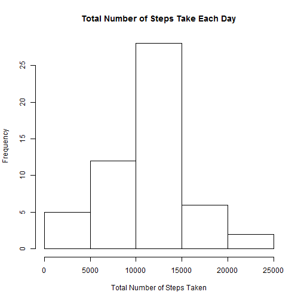
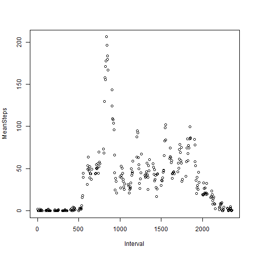
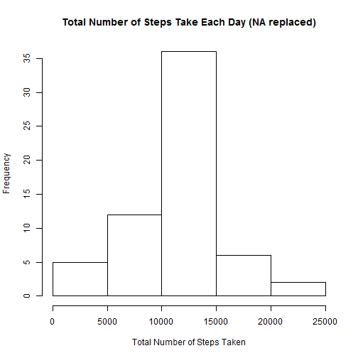
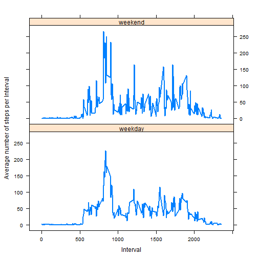

## Loading and preprocessing the data

### 1. Load Data

```r
act <- read.csv("activity.csv")
names(act)[1] <- "Steps"
names(act)[3] <- "Interval"
```
### 2. Process/Transform the data into a format suitab;e for your analysis

```r
install.packages("dplyr")
```

```
## Installing package into 'C:/Users/Matt/Documents/R/win-library/3.1'
## (as 'lib' is unspecified)
```

```
## package 'dplyr' successfully unpacked and MD5 sums checked
## 
## The downloaded binary packages are in
## 	C:\Users\Matt\AppData\Local\Temp\RtmpygkZLb\downloaded_packages
```

```r
library(dplyr)
```

```
## 
## Attaching package: 'dplyr'
## 
## The following objects are masked from 'package:stats':
## 
##     filter, lag
## 
## The following objects are masked from 'package:base':
## 
##     intersect, setdiff, setequal, union
```

```r
install.packages("lattice")
```

```
## Installing package into 'C:/Users/Matt/Documents/R/win-library/3.1'
## (as 'lib' is unspecified)
```

```
## package 'lattice' successfully unpacked and MD5 sums checked
## 
## The downloaded binary packages are in
## 	C:\Users\Matt\AppData\Local\Temp\RtmpygkZLb\downloaded_packages
```

```r
library(lattice)
install.packages("tidyr")
```

```
## Installing package into 'C:/Users/Matt/Documents/R/win-library/3.1'
## (as 'lib' is unspecified)
```

```
## package 'tidyr' successfully unpacked and MD5 sums checked
## 
## The downloaded binary packages are in
## 	C:\Users\Matt\AppData\Local\Temp\RtmpygkZLb\downloaded_packages
```

```r
library(tidyr)
install.packages("lubridate")
```

```
## Installing package into 'C:/Users/Matt/Documents/R/win-library/3.1'
## (as 'lib' is unspecified)
```

```
## package 'lubridate' successfully unpacked and MD5 sums checked
## 
## The downloaded binary packages are in
## 	C:\Users\Matt\AppData\Local\Temp\RtmpygkZLb\downloaded_packages
```

```r
library(lubridate)
```
### Change Date format to column with date type

```r
act$date <- as.Date(act$date , format = "%Y-%m-%d")

act <- act[order(act$date, act$Interval) , ]
names(act)[2] <- "Date"
```
### Create total steps per day

```r
act.day <- aggregate(act$Steps, by =list (act$Date), sum)
names(act.day)[1] <- "Date"
names(act.day)[2] <- "Steps"
```
### Create total steps per interval

```r
act.int <- aggregate(act$Steps, by=list (act$Interval), sum, na.rm=TRUE, na.action=NULL)
names(act.int)[1] <- "Interval"
names(act.int)[2] <- "Steps"
```
### Create dataframe with with mean steps per interval

```r
act.meanint <- aggregate(act$Steps, by=list(act$Interval), mean, na.rm=TRUE, na.action=NULL)
names(act.meanint)[1] <- "Interval"
names(act.meanint)[2] <- "MeanSteps"
```

## What is mean total number of steps taken per day?

### 1. Make a histogram of total number of steps taken each day (ignore missing values)

```r
act.dayNA <- act.day[!is.na(act.day$Steps), ]

hist(act.day$Steps, 
  main = "Total Number of Steps Take Each Day",
  xlab= "Total Number of Steps Taken",
  ylab= "Frequency")
```

 
### 2. Calculate and report the mean and median total number of steps taken  
  
### Mean number of steps taken each day  

```r
act.mean <- mean(act.day$Steps, na.rm=TRUE)
mean(act.mean)
```

```
## [1] 10766.19
```

### Median number of steps taken each day

```r
act.median <- median(act.day$Steps, na.rm=TRUE)
median(act.median)
```

```
## [1] 10765
```

## What is the average daily activity pattern?

### 1. Make a Time Series Plot of Average Daily Actvity

```r
plot(act.meanint)
```

 
### 2. which interval, on average across all the days contains the maximum number of steps

### Which Row 

```r
which.max( act.meanint[,2])
```

```
## [1] 104
```
### What is the Mean Value 

```r
max(act.meanint[,2])
```

```
## [1] 206.1698
```
## Imputing missing values

#### 1. Calculate and report the total number of missing values in the dataset

```r
sum(!complete.cases(act))
```

```
## [1] 2304
```
### 2. Fill in the missing values in the dataset

```r
act.NA <- merge(act, act.meanint, by = "Interval", sort = FALSE)
## replace NA in Steps with MeanSteps value
names(act.NA)[3] <- "Date"

# Sort data by Date and Interval columns
act.NA <- act.NA[order(act.NA$Date, act.NA$Interval) , ]

act.NA$Steps <- ifelse(is.na(act.NA$Steps), act.NA$MeanSteps, act.NA$Steps)
act.NA$MeanSteps <- NULL
```
### 3. New dataset to reflect no missing values

```r
act.day2 <- aggregate(act.NA$Steps, by =list(act.NA$Date), sum)
names(act.day2)[1] <- "Date"
names(act.day2)[2] <- "Steps"


act.day2 <- aggregate(act.NA2$Steps, by =list(act.NA2$Date), sum)
names(act.day2)[1] <- "Date"
names(act.day2)[2] <- "Steps"
```
### 4. Create a Histogram of Total Number of Steps per day

```r
hist(act.day2$Steps, 
  main = "Total Number of Steps Take Each Day (NA replaced)",
  xlab= "Total Number of Steps Taken",
  ylab= "Frequency")
```

 
#### 4.B Find Mean and Median total number of steps taken per day

```r
mean(act.day2$Steps)
```

```
## [1] 10766.19
```

```r
median(act.day2$Steps)
```

```
## [1] 10766.19
```
## Are there differences in activity patterns between weekdays and weekends?

### Create a new factor in th dataset by weekday and weekend

```r
act.NA2$Weekday <-ifelse(weekdays(as.Date(act.day2$Date)) %in% 
                                   c("Saturday", "Sunday"), 
                                "weekend", "weekday")
```

### Make a panel plot containting a time series plot of the 5-minute interval and the average number
### of steps taken averaged across weekday days and weekend days. Use the simulated data.


```r
act.NA2$Weekday <-ifelse(weekdays(act.day2$Date) %in% 
                                   c("Saturday", "Sunday"), 
                                "weekend", "weekday")

act.meanintweekday <- aggregate(act.NA2$Steps, by=list(act.NA2$Interval, act.NA2$Weekday2), mean, na.rm=TRUE, na.action=NULL)
names(act.meanintweekday)[1] <- "Interval"
names(act.meanintweekday)[2] <- "Weekday"
names(act.meanintweekday)[3] <- "MeanSteps"


xyplot(act.meanintweekday$MeanSteps ~ act.meanintweekday$Interval | act.meanintweekday$Weekday,
       layout=c(1,2),
       type="1",
       xlab = "Interval",
       ylab = "Number of Steps")
```

 
